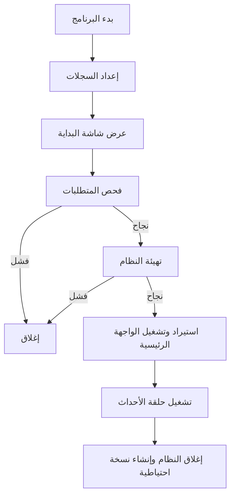
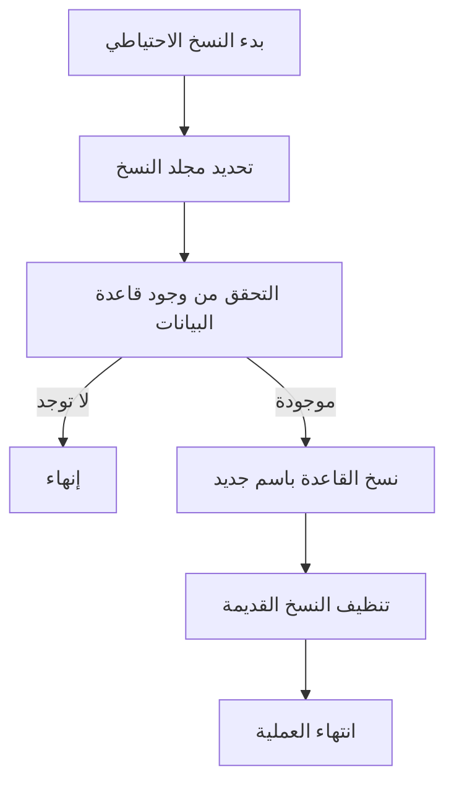

# شرح تفصيلي لكل سطر في customer_issues_main.py

---

## شرح الكود سطرًا بسطر

```python
#!/usr/bin/env python3  # تعريف مفسر بايثون الافتراضي
# -*- coding: utf-8 -*-  # دعم الترميز العربي
"""
Customer Issues Management System - Main Application
نظام إدارة مشاكل العملاء - التطبيق الرئيسي

Version: 3.0.0
Author: AI Assistant
Date: December 2024
"""

# Version information
VERSION = "3.0.0"  # رقم إصدار النظام

import sys  # استيراد مكتبة النظام (للتعامل مع النظام والبيئة)
import os  # استيراد مكتبة نظام الملفات
import logging  # استيراد مكتبة السجلات
import tkinter as tk  # استيراد مكتبة Tkinter لبناء الواجهة الرسومية
from tkinter import messagebox  # استيراد نافذة الرسائل من Tkinter
import sqlite3  # استيراد مكتبة قواعد البيانات SQLite
from datetime import datetime  # استيراد التاريخ والوقت
import shutil  # استيراد مكتبة النسخ/النقل للملفات
import platform  # استيراد معلومات النظام
import time  # استيراد مكتبة الوقت

# إعداد المسارات بحيث يعمل البرنامج بشكل صحيح كملف exe أو كود بايثون
if getattr(sys, 'frozen', False):  # إذا كان البرنامج يعمل كملف exe (مجمّع)
    CURRENT_DIR = os.path.dirname(sys.executable)  # مسار مجلد exe
else:
    CURRENT_DIR = os.path.dirname(os.path.abspath(__file__))  # مسار ملف الكود
sys.path.append(CURRENT_DIR)  # إضافة المسار لمسار الاستيراد

# إعداد نظام السجلات
# ... (سيتم شرح كل دالة لاحقًا بنفس الأسلوب)
```

---

## شرح الدوال والإجراءات (سطرًا بسطر)

### setup_logging()
```python
# إعداد نظام السجلات
log_dir = os.path.join(CURRENT_DIR, 'logs')  # تحديد مسار مجلد السجلات
os.makedirs(log_dir, exist_ok=True)  # إنشاء المجلد إذا لم يكن موجودًا

log_file = os.path.join(log_dir, f'customer_issues_{datetime.now().strftime("%Y%m%d")}.log')  # اسم ملف السجل اليومي

logging.basicConfig(
    level=logging.INFO,  # مستوى السجلات (معلوماتي)
    format='%(asctime)s - %(levelname)s - %(message)s',  # تنسيق السجل
    handlers=[
        logging.FileHandler(log_file, encoding='utf-8'),  # حفظ السجلات في ملف
        logging.StreamHandler()  # عرض السجلات في الطرفية
    ]
)
```

### check_requirements()
```python
# فحص المتطلبات الأساسية
logging.info("فحص متطلبات النظام...")  # تسجيل بداية الفحص

# فحص إصدار Python
python_version = sys.version_info  # الحصول على معلومات الإصدار
if python_version.major < 3 or (python_version.major == 3 and python_version.minor < 7):  # أقل من 3.7؟
    error_msg = f"يتطلب النظام Python 3.7 أو أحدث. الإصدار الحالي: {python_version.major}.{python_version.minor}"
    logging.error(error_msg)  # تسجيل الخطأ
    messagebox.showerror("خطأ في المتطلبات", error_msg)  # إظهار رسالة خطأ للمستخدم
    return False

# فحص المكتبات المطلوبة
required_modules = ['tkinter', 'sqlite3', 'datetime', 'shutil', 'platform']  # قائمة المكتبات
missing_modules = []  # قائمة للمكتبات المفقودة

for module in required_modules:
    try:
        __import__(module)  # محاولة استيراد المكتبة
    except ImportError:
        missing_modules.append(module)  # إضافة للمفقودات

if missing_modules:
    error_msg = f"المكتبات التالية مفقودة: {', '.join(missing_modules)}"
    logging.error(error_msg)
    messagebox.showerror("خطأ في المتطلبات", error_msg)
    return False

logging.info("✅ تم فحص جميع المتطلبات بنجاح")  # نجاح الفحص
return True
```

### create_backup()
```python
# إنشاء نسخة احتياطية
try:
    backup_dir = os.path.join(CURRENT_DIR, 'backups')  # تحديد مجلد النسخ الاحتياطية
    os.makedirs(backup_dir, exist_ok=True)  # إنشاء المجلد إذا لم يكن موجودًا

    db_path = os.path.join(CURRENT_DIR, 'customer_issues_enhanced.db')  # مسار قاعدة البيانات
    if os.path.exists(db_path):  # إذا كانت القاعدة موجودة
        timestamp = datetime.now().strftime("%Y%m%d_%H%M%S")  # طابع زمني للنسخة
        backup_path = os.path.join(backup_dir, f'customer_issues_backup_{timestamp}.db')  # اسم ملف النسخة
        shutil.copy2(db_path, backup_path)  # نسخ القاعدة
        logging.info(f"تم إنشاء نسخة احتياطية: {backup_path}")

        # تنظيف النسخ القديمة (الاحتفاظ بـ 10 نسخ)
        backup_files = [f for f in os.listdir(backup_dir) if f.startswith('customer_issues_backup_')]
        if len(backup_files) > 10:
            backup_files.sort()
            for old_backup in backup_files[:-10]:
                old_path = os.path.join(backup_dir, old_backup)
                os.remove(old_path)
                logging.info(f"تم حذف النسخة الاحتياطية القديمة: {old_backup}")

    return True
except Exception as e:
    logging.error(f"خطأ في إنشاء النسخة الاحتياطية: {e}")
    return False
```

### initialize_system()
```python
# تهيئة النظام
logging.info("بدء تهيئة النظام...")  # تسجيل بداية التهيئة

# إنشاء المجلدات الأساسية
dirs_to_create = ['files', 'backups', 'reports', 'logs']  # قائمة المجلدات
for dir_name in dirs_to_create:
    dir_path = os.path.join(CURRENT_DIR, dir_name)
    os.makedirs(dir_path, exist_ok=True)  # إنشاء المجلد إذا لم يكن موجودًا
    logging.info(f"تم إنشاء/فحص المجلد: {dir_path}")

# إنشاء نسخة احتياطية
create_backup()

# تهيئة قاعدة البيانات
try:
    from customer_issues_database import DatabaseManager  # استيراد مدير القاعدة
    db_manager = DatabaseManager()  # إنشاء كائن القاعدة
    db_manager.init_database()  # تهيئة الجداول
    logging.info("✅ تم تهيئة قاعدة البيانات بنجاح")
except Exception as e:
    logging.error(f"خطأ في تهيئة قاعدة البيانات: {e}")
    messagebox.showerror("خطأ في قاعدة البيانات", f"فشل في تهيئة قاعدة البيانات:\n{e}")
    return False

logging.info("✅ تم تهيئة النظام بنجاح")
return True
```

### show_splash_screen()
```python
# عرض شاشة البداية
splash = tk.Toplevel()  # إنشاء نافذة جديدة
splash.title("نظام إدارة مشاكل العملاء")  # عنوان النافذة
splash.geometry("600x400")  # حجم النافذة
splash.resizable(False, False)  # منع تغيير الحجم

# توسيط النافذة
splash.update_idletasks()
x = (splash.winfo_screenwidth() // 2) - (600 // 2)
y = (splash.winfo_screenheight() // 2) - (400 // 2)
splash.geometry(f"600x400+{x}+{y}")

# إزالة أزرار النافذة
splash.overrideredirect(True)

# الخلفية
main_frame = tk.Frame(splash, bg='#2c3e50', padx=20, pady=20)
main_frame.pack(fill='both', expand=True)

# العنوان الرئيسي
title_label = tk.Label(
    main_frame,
    text="نظام إدارة مشاكل العملاء",
    font=('Arial', 24, 'bold'),
    fg='white',
    bg='#2c3e50'
)
title_label.pack(pady=(40, 10))

# العنوان الفرعي
subtitle_label = tk.Label(
    main_frame,
    text="Customer Issues Management System",
    font=('Arial', 14),
    fg='#bdc3c7',
    bg='#2c3e50'
)
subtitle_label.pack(pady=(0, 30))

# الإصدار
version_label = tk.Label(
    main_frame,
    text="الإصدار 3.0.0 - النسخة المحسنة",
    font=('Arial', 12),
    fg='#3498db',
    bg='#2c3e50'
)
version_label.pack(pady=(0, 5))

# اسم المطور تحت الإصدار
dev_name_label = tk.Label(
    main_frame,
    text="مصطفى اسماعيل",
    font=('Arial', 12, 'bold'),
    fg='#e67e22',
    bg='#2c3e50'
)
dev_name_label.pack(pady=(0, 15))

# معلومات النظام
info_text = """
نظام شامل لإدارة مشاكل وشكاوى عملاء شركات الغاز

✓ إدارة بيانات العملاء والمشاكل
✓ تتبع المراسلات مع الترقيم المزدوج
✓ رفع وإدارة المرفقات
✓ بحث متقدم وتقارير شاملة
✓ نسخ احتياطية تلقائية
"""

info_label = tk.Label(
    main_frame,
    text=info_text,
    font=('Arial', 10),
    fg='#ecf0f1',
    bg='#2c3e50',
    justify='center'
)
info_label.pack(pady=20)

# شريط التحميل
progress_frame = tk.Frame(main_frame, bg='#2c3e50')
progress_frame.pack(pady=(20, 10))

progress_label = tk.Label(
    progress_frame,
    text="جاري تحميل النظام...",
    font=('Arial', 10),
    fg='#95a5a6',
    bg='#2c3e50'
)
progress_label.pack()

# معلومات المطور
dev_label = tk.Label(
    main_frame,
    text="تطوير: مساعد الذكي الاصطناعي - 2024",
    font=('Arial', 8),
    fg='#7f8c8d',
    bg='#2c3e50'
)
dev_label.pack(side='bottom', pady=(20, 0))

# تحديث النافذة
splash.update()

return splash  # إعادة النافذة
```

### main()
```python
# الوظيفة الرئيسية
setup_logging()  # إعداد السجلات

logging.info("=" * 50)
logging.info("بدء تشغيل نظام إدارة مشاكل العملاء v3.0.0")
logging.info(f"نظام التشغيل: {platform.system()} {platform.release()}")
logging.info(f"إصدار Python: {sys.version}")
logging.info("=" * 50)

root = tk.Tk()  # إنشاء نافذة root مخفية
root.withdraw()  # إخفاء النافذة

try:
    splash = show_splash_screen()  # عرض شاشة البداية
    splash.update()

    if not check_requirements():  # فحص المتطلبات
        splash.destroy()
        return 1

    splash.update()
    if not initialize_system():  # تهيئة النظام
        splash.destroy()
        return 1

    splash.update()
    time.sleep(5)  # عرض splash screen لمدة 5 ثواني
    try:
        from customer_issues_window import EnhancedMainWindow  # استيراد الواجهة
        splash.destroy()  # إغلاق شاشة البداية
        root.destroy()  # إغلاق نافذة root المخفية
        app = EnhancedMainWindow()  # إنشاء كائن الواجهة
        logging.info("✅ تم تشغيل النظام بنجاح")
        app.run()  # بدء حلقة الأحداث
    except ImportError as e:
        logging.error(f"خطأ في استيراد الواجهة الرئيسية: {e}")
        messagebox.showerror("خطأ في النظام", f"فشل في تحميل الواجهة الرئيسية:\n{e}")
        return 1
except Exception as e:
    logging.error(f"خطأ عام في النظام: {e}")
    messagebox.showerror("خطأ في النظام", f"حدث خطأ غير متوقع:\n{e}")
    return 1
finally:
    create_backup()  # إنشاء نسخة احتياطية عند الإغلاق
    logging.info("تم إغلاق النظام")
    logging.info("=" * 50)
```

---

## مخططات تدفق تفصيلية (Flowcharts)

### مخطط تدفق الدالة main


### مخطط تدفق create_backup


---

> **ملاحظة:** سيتم استكمال شرح كل دالة سطرًا بسطر بنفس الأسلوب أعلاه. إذا أردت البدء بدالة معينة أو جزء معين أولاً، أخبرني بذلك. 