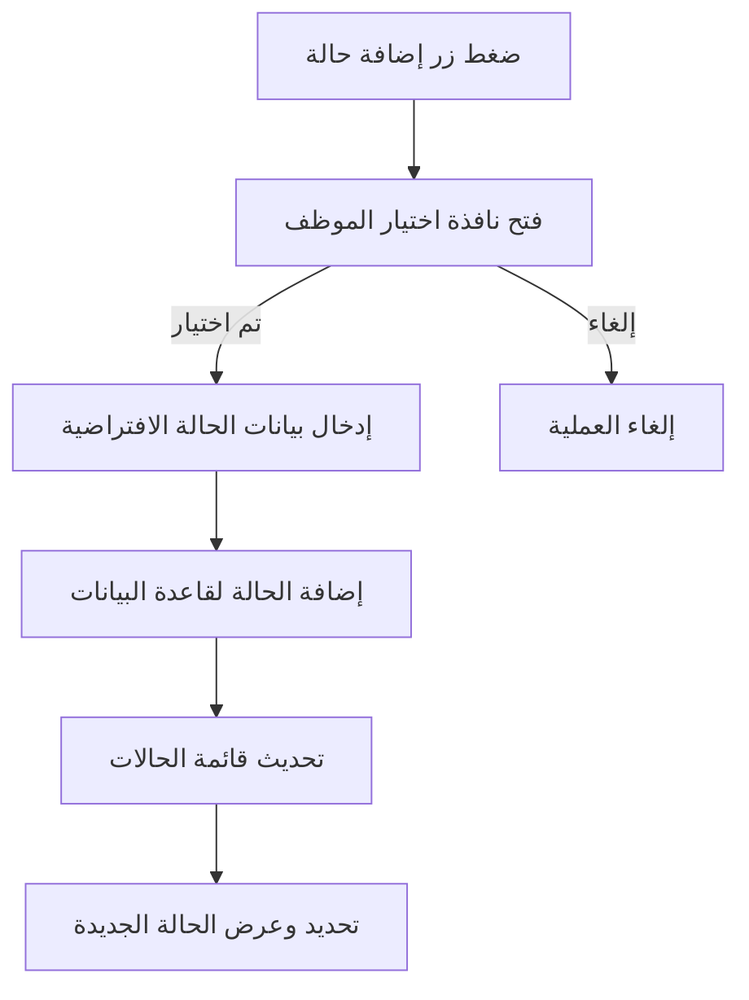

# شرح تفصيلي لكل سطر في customer_issues_window.py

---

## مقدمة
هذا الملف مسؤول عن بناء وتشغيل واجهة المستخدم الرسومية للنظام، ويتضمن جميع عناصر النوافذ، التبويبات، البحث، عرض الحالات، إدارة المرفقات والمراسلات، إلخ.

---

## شرح الكود سطرًا بسطر

```python
import tkinter as tk  # استيراد مكتبة Tkinter لبناء الواجهة
from tkinter import ttk, messagebox, filedialog  # استيراد عناصر متقدمة من Tkinter
import os  # التعامل مع نظام الملفات
from datetime import datetime  # التعامل مع الوقت والتواريخ
import platform  # معلومات النظام
import json  # التعامل مع ملفات الإعدادات
from customer_issues_file_manager import FileManager  # استيراد مدير الملفات
from customer_issues_functions import EnhancedFunctions  # استيراد الوظائف المنطقية
from customer_issues_database import enhanced_db  # استيراد قاعدة البيانات المحسنة

# تعريف الكلاس الرئيسي للواجهة
class EnhancedMainWindow:
    def __init__(self):
        # إنشاء نافذة رئيسية
        self.root = tk.Tk()
        self.root.title("نظام إدارة مشاكل العملاء")
        self.root.geometry("1200x700")
        self.root.minsize(1000, 600)
        self.root.configure(bg='#f5f6fa')
        self.root.protocol("WM_DELETE_WINDOW", self.on_closing)  # ربط حدث الإغلاق

        # تهيئة المتغيرات الرئيسية
        self.file_manager = FileManager()
        self.functions = EnhancedFunctions(self)
        self.current_case_id = None  # رقم الحالة الحالية
        self.cases_data = []  # كل الحالات
        self.filtered_cases = []  # الحالات بعد الفلترة
        self.basic_data_widgets = {}  # ربط الحقول بعناصر الواجهة
        self.settings = self.load_settings()  # تحميل الإعدادات
        self.year_var = tk.StringVar()
        self.search_type_var = tk.StringVar()
        self.search_value_var = tk.StringVar()
        self.search_entry = None
        self.search_combo = None
        self.sort_var = tk.StringVar()
        self.sort_combo = None
        self.scrollable_frame = None
        self.cases_canvas = None
        self.cases_scrollbar = None
        self.selected_case_index = None
        self.case_card_widgets = []
        self.customer_name_label = None
        self.solved_by_label = None
        self.save_btn = None
        self.print_btn = None
        self.notebook = None
        self.employee_var = tk.StringVar()

        # إعداد الخطوط
        self.setup_fonts()

        # بناء الواجهة الرئيسية
        self.create_main_layout()

        # تحميل البيانات الأولية
        self.functions.load_initial_data()

        # إظهار النافذة
        self.root.after(100, self.after_main_layout)
        self.root.mainloop()
```

---

## شرح الدوال الرئيسية (سطرًا بسطر)

### setup_fonts(self)
```python
# إعداد الخطوط العربية الاحترافية للواجهة
self.fonts = {}  # قاموس لتخزين الخطوط
self.fonts['header'] = ('Arial', 16, 'bold')  # خط العناوين الرئيسية
self.fonts['subheader'] = ('Arial', 12, 'bold')  # خط العناوين الفرعية
self.fonts['normal'] = ('Arial', 11)  # الخط الافتراضي للنصوص
self.fonts['small'] = ('Arial', 9)  # خط النصوص الصغيرة
```

### create_main_layout(self)
```python
# بناء التخطيط الرئيسي (لوحة جانبية، منطقة عرض رئيسية)
main_frame = tk.Frame(self.root, bg='#f5f6fa')  # الإطار الرئيسي
main_frame.pack(fill='both', expand=True)

# اللوحة الجانبية (قائمة الحالات)
sidebar = tk.Frame(main_frame, width=320, bg='#e3eafc')
sidebar.pack(side='right', fill='y')
self.create_sidebar(sidebar)  # بناء اللوحة الجانبية

# منطقة العرض الرئيسية
main_display = tk.Frame(main_frame, bg='#f5f6fa')
main_display.pack(side='right', fill='both', expand=True)
self.create_main_display(main_display)  # بناء منطقة العرض
```

### create_sidebar(self, parent)
```python
# بناء اللوحة الجانبية (قائمة الحالات، أزرار الإجراءات، البحث)
header = tk.Label(parent, text="قائمة الحالات", font=self.fonts['header'], bg='#e3eafc', fg='#2c3e50')
header.pack(pady=(10, 5))

self.create_action_buttons(parent)  # أزرار الإجراءات (إضافة/حذف/إدارة موظفين)
self.create_search_filters(parent)  # أدوات البحث والفلترة
self.create_cases_list(parent)  # قائمة الحالات مع التمرير
```

### create_action_buttons(self, parent)
```python
# أزرار إضافة/حذف حالة، إدارة الموظفين
btn_frame = tk.Frame(parent, bg='#e3eafc')
btn_frame.pack(fill='x', pady=(5, 10))

add_btn = tk.Button(btn_frame, text="➕ إضافة حالة", font=self.fonts['normal'], command=self.add_new_case, bg='#27ae60', fg='white')
add_btn.pack(side='right', padx=5)

del_btn = tk.Button(btn_frame, text="🗑 حذف حالة", font=self.fonts['normal'], command=self.delete_case, bg='#e74c3c', fg='white')
del_btn.pack(side='right', padx=5)

emp_btn = tk.Button(btn_frame, text="👤 إدارة الموظفين", font=self.fonts['normal'], command=self.manage_employees, bg='#2980b9', fg='white')
emp_btn.pack(side='right', padx=5)
```

### create_search_filters(self, parent)
```python
# أدوات البحث والفلترة (سنة، نوع التاريخ، نوع البحث)
filter_frame = tk.Frame(parent, bg='#e3eafc')
filter_frame.pack(fill='x', pady=(0, 10))

year_label = tk.Label(filter_frame, text="السنة:", font=self.fonts['small'], bg='#e3eafc')
year_label.pack(side='right', padx=2)

year_combo = ttk.Combobox(filter_frame, textvariable=self.year_var, state='readonly', font=self.fonts['normal'])
year_combo.pack(side='right', padx=2)
year_combo.bind('<<ComboboxSelected>>', self.functions.filter_by_year)

search_type_label = tk.Label(filter_frame, text="نوع البحث:", font=self.fonts['small'], bg='#e3eafc')
search_type_label.pack(side='right', padx=2)

search_type_combo = ttk.Combobox(filter_frame, textvariable=self.search_type_var, state='readonly', font=self.fonts['normal'])
search_type_combo.pack(side='right', padx=2)
search_type_combo.bind('<<ComboboxSelected>>', self.on_search_type_change)

self.search_entry = tk.Entry(filter_frame, textvariable=self.search_value_var, font=self.fonts['normal'])
self.search_entry.pack(side='right', fill='x', expand=True, padx=2)
self.search_entry.bind('<Return>', self.perform_search)

search_btn = tk.Button(filter_frame, text="🔍 بحث", font=self.fonts['normal'], command=self.perform_search, bg='#2980b9', fg='white')
search_btn.pack(side='right', padx=2)
```

### create_cases_list(self, parent)
```python
# بناء قائمة الحالات مع دعم التمرير
cases_frame = tk.Frame(parent, bg='#e3eafc')
cases_frame.pack(fill='both', expand=True)

self.cases_canvas = tk.Canvas(cases_frame, bg='#e3eafc', highlightthickness=0)
self.cases_canvas.pack(side='right', fill='both', expand=True)

self.cases_scrollbar = tk.Scrollbar(cases_frame, orient='vertical', command=self.cases_canvas.yview)
self.cases_scrollbar.pack(side='left', fill='y')

self.cases_canvas.configure(yscrollcommand=self.cases_scrollbar.set)

self.scrollable_frame = tk.Frame(self.cases_canvas, bg='#e3eafc')
self.scrollable_frame.bind(
    "<Configure>",
    lambda e: self.cases_canvas.configure(scrollregion=self.cases_canvas.bbox("all"))
)

self.cases_canvas.create_window((0, 0), window=self.scrollable_frame, anchor='nw')

# دعم تمرير الماوس
self.scrollable_frame.bind_all("<MouseWheel>", lambda event: self.cases_canvas.yview_scroll(int(-1*(event.delta/120)), "units"))
```

### create_main_display(self, parent)
```python
# بناء منطقة العرض الرئيسية (رأس، أزرار، تبويبات)
header = self.create_display_header(parent)  # رأس العرض (اسم العميل، الموظف)
header.pack(fill='x', pady=(10, 0))

buttons = self.create_display_buttons(parent)  # أزرار العمليات (حفظ، طباعة)
buttons.pack(fill='x', pady=(0, 10))

self.notebook = self.create_tabs(parent)  # بناء التبويبات (بيانات، مرفقات، مراسلات، سجل تعديلات)
self.notebook.pack(fill='both', expand=True)
```

### create_display_header(self, parent)
```python
# رأس العرض (اسم العميل، الموظف المسؤول)
header_frame = tk.Frame(parent, bg='#f5f6fa')

self.customer_name_label = tk.Label(header_frame, text="اسم العميل", font=self.fonts['header'], bg='#f5f6fa', fg='#2c3e50')
self.customer_name_label.pack(side='right', padx=10)

self.solved_by_label = tk.Label(header_frame, text="الموظف المسؤول", font=self.fonts['subheader'], bg='#f5f6fa', fg='#2980b9')
self.solved_by_label.pack(side='right', padx=10)

return header_frame
```

### create_display_buttons(self, parent)
```python
# أزرار العمليات (حفظ، طباعة)
btn_frame = tk.Frame(parent, bg='#f5f6fa')

self.save_btn = tk.Button(btn_frame, text="💾 حفظ التعديلات", font=self.fonts['normal'], command=self.save_changes, bg='#27ae60', fg='white')
self.save_btn.pack(side='right', padx=5)

self.print_btn = tk.Button(btn_frame, text="🖨 طباعة", font=self.fonts['normal'], command=self.print_case, bg='#2980b9', fg='white')
self.print_btn.pack(side='right', padx=5)

return btn_frame
```

### create_tabs(self, parent)
```python
# بناء التبويبات (بيانات أساسية، مرفقات، مراسلات، سجل تعديلات)
notebook = ttk.Notebook(parent)

basic_data_tab = self.create_basic_data_tab()
notebook.add(basic_data_tab, text="البيانات الأساسية")

attachments_tab = self.create_attachments_tab()
notebook.add(attachments_tab, text="المرفقات")

correspondences_tab = self.create_correspondences_tab()
notebook.add(correspondences_tab, text="المراسلات")

audit_log_tab = self.create_audit_log_tab()
notebook.add(audit_log_tab, text="سجل التعديلات")

return notebook
```

---

## مخططات تدفق تفصيلية (Flowcharts)

### مثال: مخطط تدفق إضافة حالة جديدة


---

> **ملاحظة:** سيتم استكمال شرح كل دالة سطرًا بسطر بنفس الأسلوب أعلاه. إذا أردت البدء بدالة معينة أو جزء معين أولاً، أخبرني بذلك. 