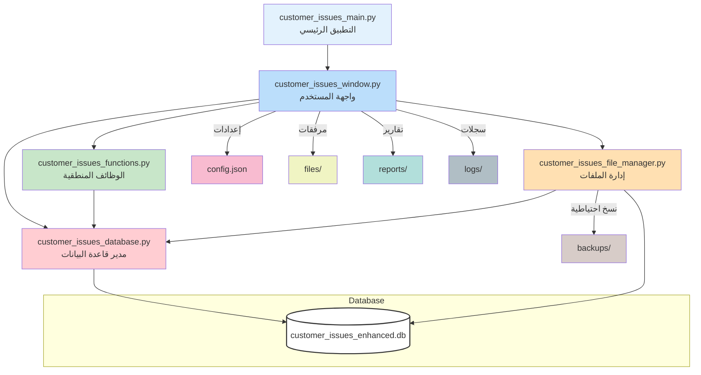

# توثيق نظام إدارة مشاكل العملاء

## 1. نظرة عامة
نظام متكامل لإدارة مشاكل وشكاوى عملاء شركات الغاز، يشمل إدارة بيانات العملاء، تتبع المراسلات، رفع المرفقات، البحث، التقارير، النسخ الاحتياطية، وسجل التعديلات.

---

## 2. مخطط هيكل المشروع

---

## 3. شرح الملفات الرئيسية ووظائفها

### 3.1 customer_issues_main.py (التطبيق الرئيسي)
- نقطة بدء النظام.
- إعداد السجلات (logs) وفحص المتطلبات.
- تهيئة المجلدات وقاعدة البيانات.
- عرض شاشة البداية (Splash) ثم تشغيل الواجهة الرئيسية.
- عند الإغلاق: إنشاء نسخة احتياطية.

### 3.2 customer_issues_window.py (واجهة المستخدم)
- بناء واجهة المستخدم الرسومية (Tkinter).
- عرض قائمة الحالات، تفاصيل الحالة، المرفقات، المراسلات، سجل التعديلات.
- يدير التفاعل مع المستخدم (إضافة/تعديل/بحث/حذف).
- يتعامل مع الإعدادات (config.json) والمرفقات (files/).
- يستدعي الوظائف المنطقية (EnhancedFunctions) ومدير الملفات (FileManager).

### 3.3 customer_issues_functions.py (الوظائف المنطقية)
- تحميل البيانات الأولية (سنوات، تصنيفات، حالات).
- تنفيذ عمليات البحث والتصفية.
- تحميل تفاصيل الحالة (بيانات، مرفقات، مراسلات، سجل تعديلات).
- إضافة وتعديل وحذف الحالات والمرفقات والمراسلات.
- واجهة وسيطة بين الواجهة وقاعدة البيانات.

### 3.4 customer_issues_file_manager.py (إدارة الملفات)
- إدارة مجلدات الحالات والمرفقات.
- نسخ وربط وفتح الملفات والمجلدات.
- تنظيف النسخ الاحتياطية القديمة.
- حساب حجم الملفات وتنسيقها.

### 3.5 customer_issues_database.py (مدير قاعدة البيانات)
- إنشاء وتحديث قاعدة البيانات والجداول:
    - employees: الموظفون
    - issue_categories: تصنيفات المشاكل
    - cases: الحالات
    - correspondences: المراسلات
    - attachments: المرفقات
    - audit_log: سجل التعديلات
- تنفيذ الاستعلامات (إضافة/تعديل/حذف/بحث).
- إدارة العلاقات بين الجداول (مفاتيح أجنبية).

---

## 4. ترابط الأجزاء
- التطبيق الرئيسي يهيئ النظام ويشغل الواجهة.
- الواجهة تتعامل مع المستخدم وتستدعي الوظائف المنطقية.
- الوظائف المنطقية تتعامل مع قاعدة البيانات ومدير الملفات.
- مدير الملفات يدير المرفقات والنسخ الاحتياطية.
- قاعدة البيانات تحفظ جميع البيانات والعلاقات.

---

## 5. الجداول الرئيسية في قاعدة البيانات
- **employees**: بيانات الموظفين (اسم، وظيفة، حالة).
- **issue_categories**: تصنيفات المشاكل (اسم، وصف، لون).
- **cases**: بيانات الحالات (عميل، رقم مشترك، تصنيف، حالة، وصف، تواريخ، موظفين).
- **correspondences**: المراسلات المرتبطة بكل حالة.
- **attachments**: المرفقات المرتبطة بكل حالة.
- **audit_log**: سجل التعديلات على الحالات.

---

## 6. المجلدات والملفات الداعمة
- **files/**: مجلد المرفقات لكل حالة.
- **backups/**: نسخ احتياطية من قاعدة البيانات.
- **logs/**: سجلات النظام.
- **reports/**: تقارير النظام.
- **config.json**: إعدادات المسارات.

---

## 7. ملخص سير العمل
1. يبدأ النظام من `customer_issues_main.py`.
2. تهيئة النظام وقاعدة البيانات.
3. عرض واجهة المستخدم (`customer_issues_window.py`).
4. المستخدم يتفاعل مع الواجهة (إضافة/بحث/تعديل).
5. الواجهة تستدعي الوظائف المنطقية (`customer_issues_functions.py`).
6. الوظائف تتعامل مع قاعدة البيانات (`customer_issues_database.py`) أو الملفات (`customer_issues_file_manager.py`).
7. يتم حفظ أو استرجاع البيانات من قاعدة البيانات أو الملفات.
8. عند الإغلاق: يتم إنشاء نسخة احتياطية تلقائياً.

---

## 8. ملاحظات تقنية
- النظام يدعم العمل كملف exe أو كود بايثون.
- جميع المسارات ديناميكية حسب مكان التشغيل.
- يدعم اللغة العربية بالكامل (واجهة وبيانات).
- قابل للتطوير والإضافة (تصنيفات، موظفين، تقارير).

--- 